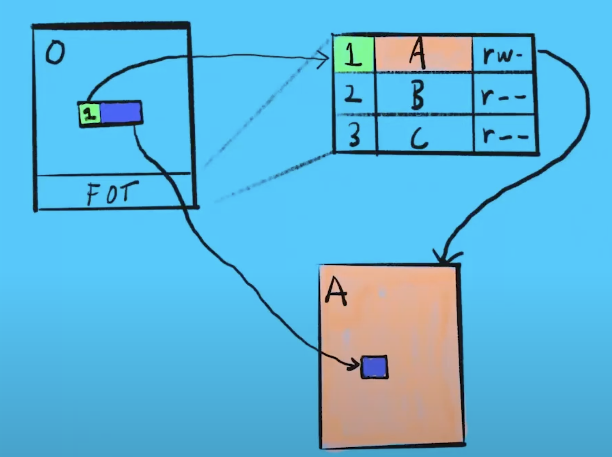
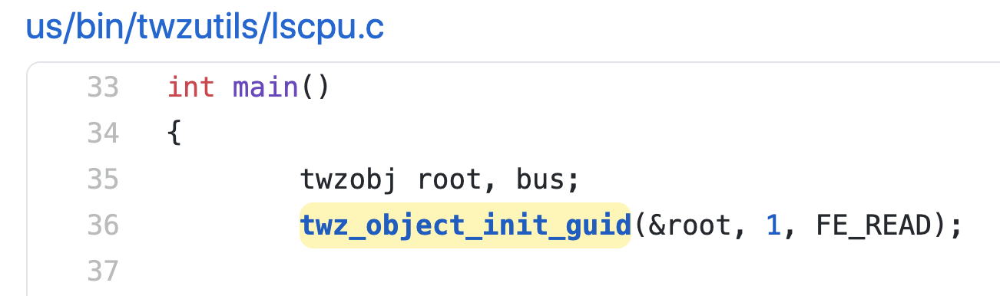

# Day 33

> 2020-11-12

## Twizzler OS

### 概要

NVM 会改变已有的编程模型和抽象。

OS 需要提供一些功能（如：持久指针）使得编程可以更加简洁高效。

NVM 的延迟很短，跟 DRAM 接近。磁盘延迟高，但是 NVM 的延迟低，甚至可能低于单个 syscall 。所以越过内核直接读写 NVM 十分有必要。

数据在磁盘、内存的存储方式不一样，互相转换也需要花费时间。但是如果内存就是持久化的，那就可以节约下这部分时间。

数据的生命周期可能比程序更久。举例：一个程序 A 创建了一个指针，这个指针本质上是一个虚拟地址，即数字。如果程序 B 想要使用这个指针，不能通过简单的复制，因为 A 和 B 的虚拟地址映射到的物理地址是不一样的。

所以需要建立一个更基本的指针，持久化指针（**关键工作**）。

- posix：没用到持久化内存的概念、需要内核介入、虚拟地址麻烦死了。
- pmdk：无需 os 支持、数据（跨机器）（分布式）共享困难、持久化指针效率低（后面讲）。
- twizzler：内核介入少、可共享、安全、持久化指针的额外开销低。

编程的话需要使用 [libtwz](https://twizzler.io/pub/docs/twizzler-current-docs.pdf) 。

twizzler 提供基础的内核服务，比如进程调度、页面错误处理、可信计算。

他们魔改了 musl ，可以将 cpp 程序编译到 twizzler 上。说明程序可以继续使用 posix ，但是性能不咋地，最好还是用 libtwz 。

由于直接读写 nvm ，内核不参与，所以需要有可信的安全措施，比如加密签名的访问控制；内核无法创建，但是可以（必须）验证它们；所有执行都必须由硬件（mmu）完成。

文章例子：访问权限就写在 fot 里。

正在努力完善崩溃一致性，没怎么提，只说了简单的 clwb 之类的。

一般 kvs 在找到数据后需要从磁盘拷贝到内存，twz 就不需要。（然而这是 nvm 的优势，不是 twz 的优势。。。）

权限管理可以在硬件完成，而且支持文件之间的权限管理（因为权限是由 fot 定的）。而 posix 则不支持交叉文件管理。

移植了 sql lite（lmbd 后端）。

lmdb 使用 mmap 磁盘。

用 twz 实现了 sql lite 使用 lmdb 的 api 。

过程中发现，很多 sql 的 api 只需要对 twz 的接口进行简单的封装。

性能和延迟比较，反正结果就是 pmdk no ，twz yes 。。。

文章认为是 pmdk 的指针低效，而且体积太大，占用缓存。

### 持久指针

twizzler 中的对象（obj）有 128 位的 ID ，这个数很大，可以包括世间万物，在任何机器上都不会重复。

使用 obj id 和偏移量可以表示一个具体数据，但是只使用 id 和 offset 会增加指针的大小和开销。

所以增加了一个中间层。

所有 obj 都有一个 FOT(Foreign Object Table) 。fot 是一个数组，每个元素的格式大致如下：

| index | flags | ID or Name |
| ----- | ----- | ---------- |
| 1     | rw-   | A          |
| 2     | r--   | B          |
| 3     | r--   | C          |

那么在一个 obj 中，如果其中一个数据是指针，那么这个指针的格式如下：

| fot entry | offset |
| --------- | ------ |


指针访问数据方式如下：



指针先通过 fot entry 找到数据所在的 obj ，然后通过 offset 找到相应的数据。fot entry 为 0 表示指向自己所在的对象。

解释数据的方式应该与数据一起保存，是一个设计的哲学，所以 fot 要和 data 一起保存：

- obj layout

| fot | data |
| --- | ---- |


fot 使得 obj 能够独立存在，即通过 obj id 来查找 obj ，而非通过相对（绝对）的物理位置。

obj id 有 128 位，足够大，所以数据可以在机器之间共享，而不止是在进程之间共享。如果把所有数据从一台机器上复制到另一台，指针的意义是不变的。

上面这句话有些难懂，我们先来和 pmdk 对比一下：

pmdk 使用的指针格式如下：

| obj id | offset |
| ------ | ------ |


pmdk 64 位的 obj id 不够大，在不同机器之间可能会有冲突。所以需要在复制数据的时候进行很复杂的预处理。

然而 twizzler 的 obj id 是 128 位的，而且可以根据需求进一步扩大，而且这还不会增加指针的大小，只会增加 fot 的大小。

### obj id

至于如何通过 obj id 找到相应的 obj ，文章里并没有说，我翻了翻 libtwz ，大概如下：

```cpp
static struct __viewrepr_bucket *__insert_obj(struct twzview_repr *v,
  objid_t id,
  uint32_t flags,
  size_t slot)
{
	int32_t idx = id % (TWZSLOT_MAX_SLOT + 1);
	struct __viewrepr_bucket *b = v->buckets;
	struct __viewrepr_bucket *pb = NULL;
	do {
		if(b[idx].id == 0) {
			b[idx].id = id;
			b[idx].slot = slot;
			b[idx].flags = flags;
			b[idx].refs = 1;
			return &b[idx];
		}
		...
	} while(idx != -1);
    ...
```

可以看出是用数组存的 obj ，而且有 TWZSLOT_MAX_SLOT 。

从下图可以看出，每台机器上的 obj id 是必然会重合的，至少会有 `1` 重合了。那么文章中所说的可以直接在机器之间共享应该是 `TODO` 。文章后面也说了，这个在分布式上应用的前景。



我翻了老半天源码，终于找到了 obj id 的分配方式，结果就是一个哈希，我吐了。。。

```cpp
objid_t obj_compute_id(struct object *obj)
{
	...
	unsigned char tmp[32];
	blake2b_final(&S, tmp, 32);
	_Alignas(16) unsigned char out[16];
	for(int i = 0; i < 16; i++) {
		out[i] = tmp[i] ^ tmp[i + 16];
	}
    ...
	return *(objid_t *)out;
}
```

> 我其实早就怀疑，这么重要的内容文章居然没有细讲，那肯定是作者为了糊弄过去。。。
