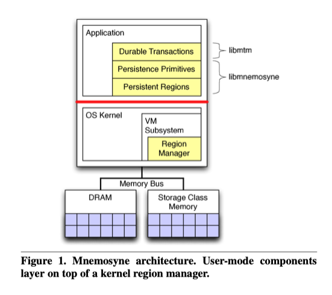

# Day 34（Mnemosyne: Lightweight Persistent Memory）

> 2020-12-03

## 介绍

Mnemosyne —— 希腊神话中的记忆女神。

本文介绍了 Mnemosyne，这是一种用于持久性存储器（Persistent Memory）编程的简单接口。 Mnemosyne 应对两个挑战：如何创建和管理这种存储，以及如何在出现故障时确保一致性。如果没有其他机制，系统故障可能会使 SCM 中的数据结构处于无效状态，从而在下次启动程序时使程序崩溃。

### 特点

- 在 Mnemosyne 中，程序员使用关键字“ pstatic”声明全局持久性数据或动态分配它们
- 提供了直接修改持久变量的原语
- 通过轻量级事务处理机制支持一致的更新

这篇文章的标题看起来像是介绍一种存储硬件，其实是介绍一套编程框架。

文章建议操作系统应将 storage-class memory （SCM）公开为持久性内存抽象，以提供对 SCM 技术持久性的直接访问。这种抽象使程序员可以持久化内存中的数据结构，而无需首先将它们转换为序列化格式。因此，树，列表和哈希可以承受程序和系统故障。此外，直接访问减少了存储延迟，因为它绕过了许多软件层，包括系统调用，文件系统和设备驱动程序。

文章认为持久性内存不是文件的替代品，而是存储少量数据的快速机制。

文章提出三个目标：

- 将数据声明为持久性必须很简单，并且持久性必须适合现有的易失性数据结构的编程模型
- 系统必须支持对数据结构的一致修改
- 寻求一种与现有处理器兼容的设计

Mnemosyne 提供了类似于 C 的低级编程接口，用于访问持久性内存。作者将 Mnemosyne 作为库，并对 Linux 内核的一小部分修改来实现。

### 设计

Mnemosyne 向程序员提供了持久性内存的抽象。该系统有三个目标：

1. 用户模式对持久性的访问避免了进入内核的等待时间，并为实现持久性提供了灵活性。

2. 一致的更新可修改持久数据，而不会在出现故障时损害正确性。

3. 常规硬件通过允许现有处理器使用新的内存技术，降低使用的障碍。

Mnemosyne 通过“持久区域”实现了第一个目标，持久区域是由内核创建和虚拟化的一部分内存，但可以直接从用户模式访问。

Mnemosyne 为第二个目标提供了两层解决方案。 Mnemosyne 的下层提供持久性原语，这是用于使用持久性存储器进行编程的支持例程。 Mnemosyne 的上层提供了编译器支持的持久内存事务，以使通用代码能够创建和修改持久数据结构。

为了满足第三个目标，文章提出的一致的更新机制依赖于现有体系结构中可用的硬件原语。虽然为带有 DRAM 和 SCM 的系统设计了 Mnemosyne，但它同样适用于将 SCM 用于易失性存储的系统。

#### 持久区域

Mnemosyne 通过 Persistent Regions 抽象将存储类内存直接提供给应用程序程序员：用户模式代码可以读取或写入的数据段，并且在应用程序或系统崩溃时幸免。Persistent Regions 被映射到固定的虚拟地址以支持基于指针的数据结构。

#### 一致更新

文件系统使用各种技术来确保一致性。

确保一致性的主要机制是对写入进行排序，文章确定了四种常见的机制。

- 单变量更新
- 追加更新
- 影子更新
- 就地更新

Mnemosyne 提供了一组持久性原语，这是使程序员能够实现这些一致性机制的低级操作。

#### 持久内存事务

Mnemosyne 提供持久的内存事务以支持就地更新。

Mnemosyne 提供了一个编译器，可将常规 C / C ++代码转换为事务。程序员将 atomic 关键字放在更新持久性数据结构的代码块之前，然后编译器生成将所有内存引用传递给事务系统的代码。

#### 持久性内存泄漏

Mnemosyne 提供了两种机制来防止泄漏。

在分配期间，Mnemosyne 要求程序提供一个持久的指针来接收内存，从而确保在发生崩溃时不会丢失内存。其次，Mnemosyne 通过将持久性内存交换到文件来虚拟化持久性内存。这样可以确保一个程序中的泄漏仅影响该程序，而不会降低其他程序的持久性内存可用性。当确实发生泄漏时，程序可以通过分配新的持久性区域，然后将实时数据从现有区域复制到新区域中来进行恢复。

## 测试结果

文章称 Mnemosyne 可以 3 微秒内将数据持久化。此外，当将其应用于 OpenLDAP 目录服务器时，性能可提高 35％。在微基准研究中，Mnemosyne 可以比为磁盘设计的替代持久性策略（例如 Berkeley DB 或 Boost 序列化）快 1400％。
