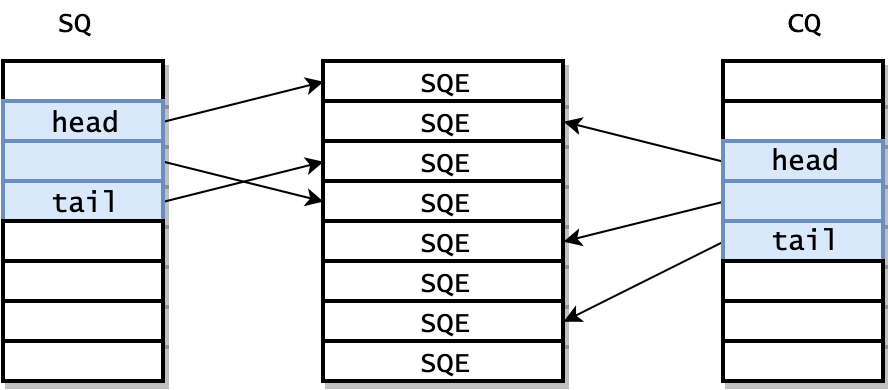

# Day 37

> 2020-12-27

## io_uring 笔记

### 概述

应用程序可以使用两个队列：Submission Queue(SQ) 和 Completion Queue(CQ) 来和 Kernel 进行通信。

```cpp
#include <linux/io_uring.h>

// syscall id: 425
int io_uring_setup(u32 entries, struct io_uring_params *p);

// syscall id: 426
int io_uring_enter(unsigned int fd, unsigned int to_submit,
                   unsigned int min_complete, unsigned int
                   flags, sigset_t *sig);

// syscall id: 427
int io_uring_register(unsigned int fd, unsigned int opcode,
                      void *arg, unsigned int nr_args);
```

### io_uring_setup

io_uring_setup 需要两个参数，entries 和 io_uring_params。

entries 代表 queue depth。

io_uring_params 的定义如下：

```cpp
struct io_uring_params {
	__u32 sq_entries;
	__u32 cq_entries;
	__u32 flags;
	__u32 sq_thread_cpu;
	__u32 sq_thread_idle;
	__u32 resv[5];
	struct io_sqring_offsets sq_off;
	struct io_cqring_offsets cq_off;
};

struct io_sqring_offsets {
	__u32 head;
	__u32 tail;
	__u32 ring_mask;
	__u32 ring_entries;
	__u32 flags;
	__u32 dropped;
	__u32 array;
	__u32 resv1;
	__u64 resv2;
};

struct io_cqring_offsets {
	__u32 head;
	__u32 tail;
	__u32 ring_mask;
	__u32 ring_entries;
	__u32 overflow;
	__u32 cqes;
	__u64 resv[2];
};
```

其中，flags、sq_thread_cpu、sq_thread_idle 属于输入参数，用于定义 io_uring 在内核中的行为。其他参数属于输出参数，由内核负责设置。

在 io_setup 返回的时候，内核已经初始化好了 SQ 和 CQ，此外，还有内核还提供了一个 Submission Queue Entries(SQEs) 数组。

由于 SQ，CQ，SQEs 是在内核中分配的，所以用户态程序并不能直接访问。io_setup 的返回值是一个 fd ，应用程序使用这个 fd 进行 mmap，和 kernel 共享一块内存。



之所以额外采用了一个数组保存 SQEs ，是为了方便通过 RingBuffer 提交内存上不连续的请求。SQ 和 CQ 中每个节点保存的都是 SQEs 数组的偏移量，而不是实际的请求，实际的请求只保存在 SQEs 数组中。这样在提交请求时，就可以批量提交一组 SQEs 上不连续的请求。
